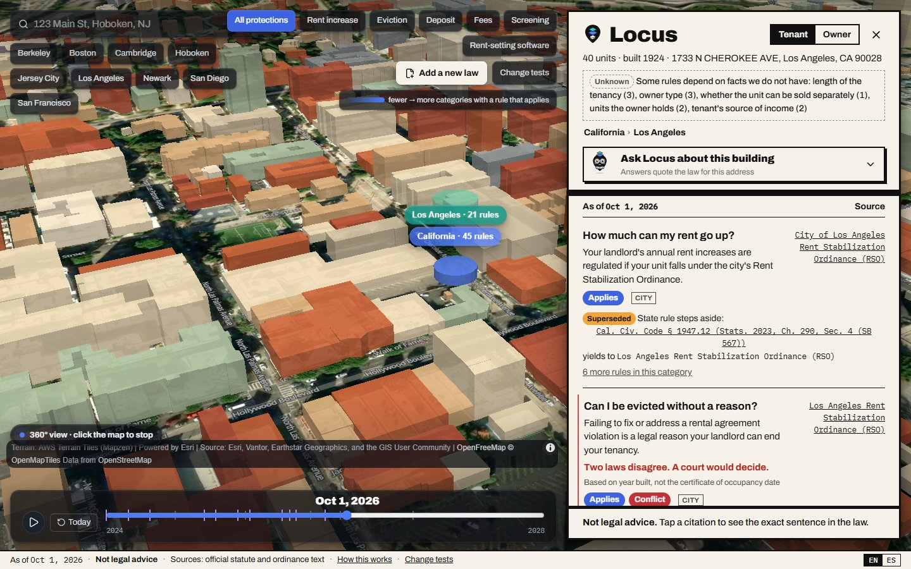
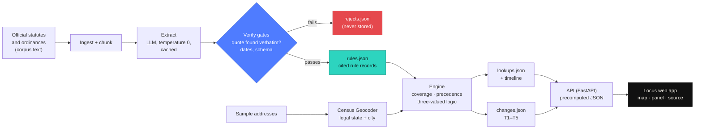
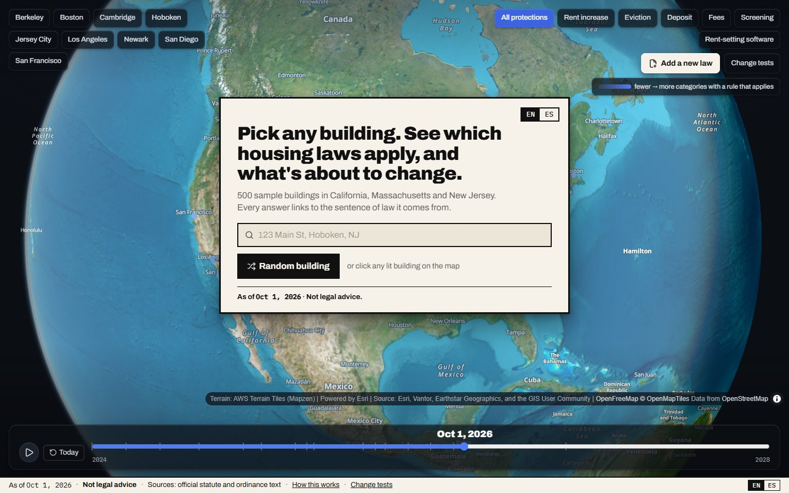
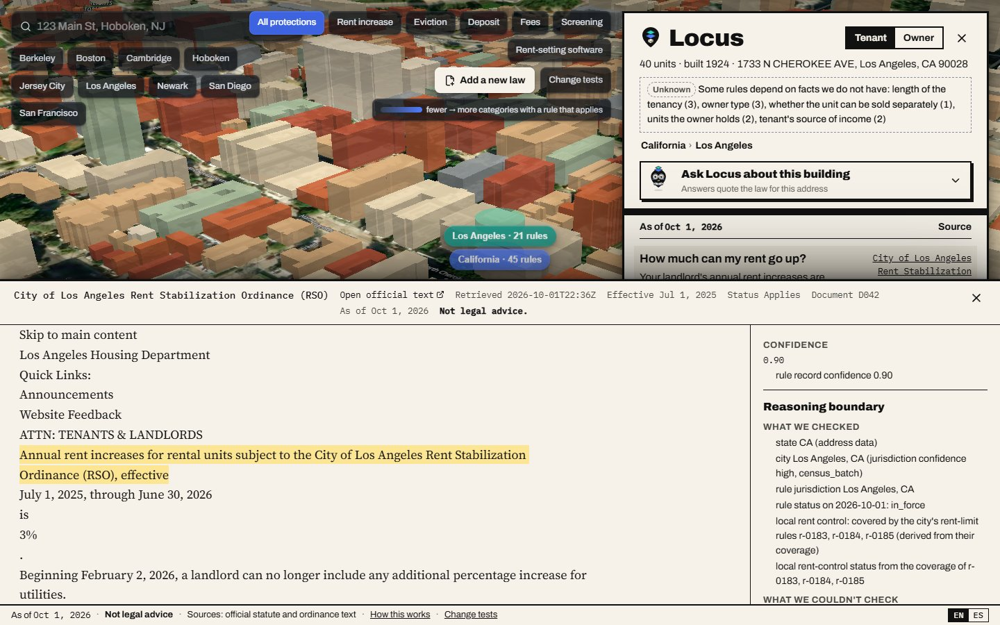
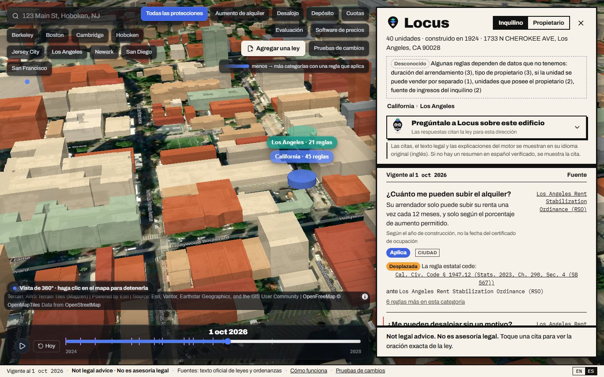
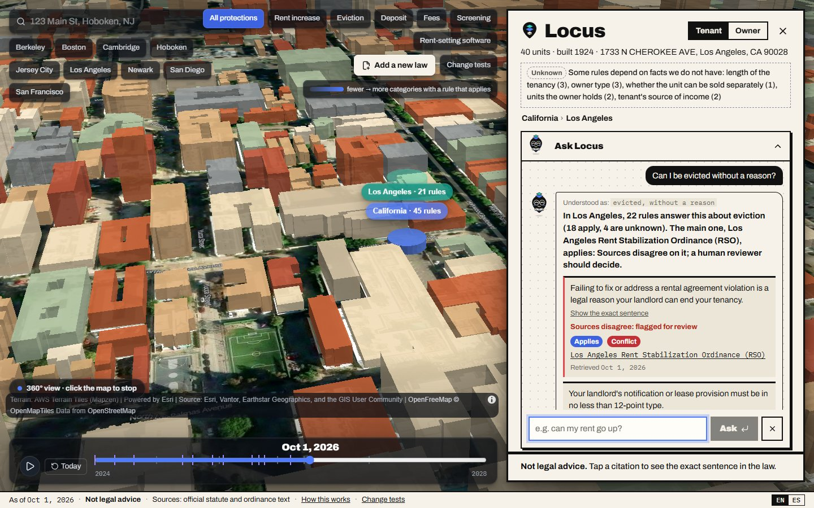
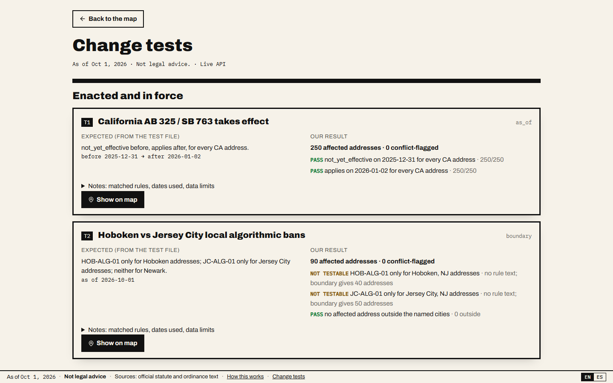

<p align="center">
  <picture>
    <source media="(prefers-color-scheme: dark)" srcset="assets/locus-logo-dark.png">
    
  </picture>
</p>

<h1 align="center">Locus · Rental Housing Law Navigator</h1>

<p align="center">
  <strong>Pick any building. See which housing laws apply — and why.</strong><br/>
  Every answer is traced to the exact sentence of law it comes from, with its as-of date,
  citation and retrieval date. When a fact is missing, Locus says <em>unknown</em> instead of guessing.
</p>

<p align="center">
  
  
  
  
  
  
  <a href="https://rental-law-navigator.vercel.app"></a>
</p>

<p align="center">
  <a href="https://rental-law-navigator.vercel.app">
    
  </a>
</p>

> **⚖️ Not legal advice.** Locus is a prototype built from a fixed public corpus for the
> MIT AI Hackathon x RealPage. It is not a compliance certification. Every answer shows its
> as-of date, the source citation and the date the source was retrieved. See
> **[SAFETY.md](SAFETY.md)**.

---

## What it is

Locus reads official statutes and ordinances for California, New Jersey and Massachusetts
(state and city level), turns them into cited rule records, and answers — for any of the
sample buildings and any date — which rules apply. Each rule gets one honest result:

<p align="center">
  <code>applies</code> &nbsp;·&nbsp; <code>unknown</code> &nbsp;·&nbsp; <code>superseded</code> &nbsp;·&nbsp; <code>not_yet_effective</code> &nbsp;·&nbsp; <code>pending</code>
</p>

Rules that do not apply are left out. Failed measures are never shown as law, and pending
bills are never in force.

- 📜 **Rule extraction (Module A)** — an LLM reads every corpus document that has text and
  writes schema-valid rule records. Each record's quote is checked **verbatim** against the
  source; a quote that is not found is rejected and logged, never stored.
- 📍 **Address lookup (Module B)** — each address is resolved to its **legal** city through
  the Census Geocoder (the postal city is not the legal city), and each rule's coverage is
  tested with three-valued logic. `unknown` always names the missing fact.
- 🕰️ **Change tracking (Module C)** — the five change tests (T1–T5) run on any as-of date,
  listing affected and conflict-flagged addresses.
- 💬 **Plain language, in English and Spanish** — one-sentence tenant and owner answers,
  discarded whenever they state a number the quote does not contain.
- 🧭 **Reasoning boundary** — every answer lists what was checked and what could not be
  checked (owner type, tenancy length, rent amount, ...).
- 💡 **Ask Locus** — ask about a building in your own words (EN/ES); answers are assembled
  only from that building's verified rules, each with its quote and citation. No live LLM:
  if no rule covers the question, it says so instead of guessing.
- 🎬 **Demo video (57 s, with voice-over)** — [assets/demo/locus-demo.mp4](assets/demo/locus-demo.mp4).
- 🌐 **Live demo** — a 3D satellite map of every sample building:
  **[rental-law-navigator.vercel.app](https://rental-law-navigator.vercel.app)**.

---

## How it works



The LLM runs only at build time, in `navigator/extract/` (rules) and `navigator/explain/`
(summaries). Dates, jurisdiction resolution, coverage, precedence, explanations and change
tracking are deterministic Python with unit tests. Nothing in the click path calls a model:
the API serves precomputed JSON, and a missing output gives a 503, never an empty answer.
No rule text, citation, threshold or date is typed into code — everything comes from
`outputs/rules.json`, produced from corpus text.

---

## A tour of the app

<table>
  <tr>
    <td width="50%"></td>
    <td width="50%"></td>
  </tr>
  <tr>
    <td><sub><b>Start anywhere.</b> Search an address, pick a city or a random building on the satellite globe.</sub></td>
    <td><sub><b>Bird's-eye view.</b> The camera flies in and orbits the building; the Locus panel lists the rules by question, with state and city layers stacked above the roof.</sub></td>
  </tr>
  <tr>
    <td></td>
    <td></td>
  </tr>
  <tr>
    <td><sub><b>Traced to the sentence.</b> Tap a citation to open the official text with the quoted span highlighted, plus confidence and the reasoning boundary.</sub></td>
    <td><sub><b>English and Spanish.</b> Answers are translated; legal quotes stay in their original language.</sub></td>
  </tr>
  <tr>
    <td></td>
    <td></td>
  </tr>
  <tr>
    <td><sub><b>Ask Locus.</b> Ask in your own words. Loci answers only from this building's verified rules, each with its quote and citation, and says so when no rule covers the question.</sub></td>
    <td><sub><b>Change tests.</b> T1–T5 side by side: what the test file expects, what Locus computed, and which addresses are affected or flagged for human review.</sub></td>
  </tr>
</table>

---

## Quick start

```bash
python -m venv .venv
# Windows: .venv\Scripts\activate    macOS/Linux: source .venv/bin/activate
pip install -e ".[dev,llm]"

python -m navigator all        # ingest > chunk > extract > verify > geocode > lookups > changes
python -m navigator summaries  # plain-language answers (build time, cached)
python -m navigator eval       # self-evaluation; regenerates the Results block below
python -m pytest -q            # tests;  -m smoke = fail-closed checks, no network, no LLM
```

`make <target>` and `./run.ps1 <target>` (Windows) are thin wrappers with the same names.

> 💡 **Reruns offline, byte for byte.** LLM calls are cached in `cache/llm/` (committed), so
> the whole pipeline reruns with identical output and no API key. A new extraction needs
> `ANTHROPIC_API_KEY` in the environment or `.env`. Geocoding calls the public Census
> Geocoder once; results are stored in `outputs/parcels.json`.

### Add a new law (live extraction demo)

```bash
python -m navigator ingest-doc path/to/page.txt --jurisdiction "Hoboken, NJ"   # cached
python -m navigator rerun-live path/to/page.txt --jurisdiction "Hoboken, NJ"   # cache off for this doc
```

The file uses the corpus header (`SOURCE: <url>`, `RETRIEVED: YYYY-MM-DD HH:MM UTC`, blank
line). It is registered in `data/supplement/`, then extracted, verified, looked up and
change-tracked. Unaffected rules keep their ids and bytes.

### API

```bash
python -m navigator api        # http://127.0.0.1:8000/docs
```

| Endpoint | What it returns |
|---|---|
| `GET /lookup?address_id=&as_of=&role=tenant\|owner&lang=en\|es` | the Locus panel: rows by category, with quote, citation, reasoning boundary and confidence |
| `POST /lookup` | the same, run live with facts the user enters (year built, units) |
| `GET /rule/{team_rule_id}` | the record, the source text window and the highlight offsets |
| `GET /search`, `GET /resolve` | address search; map click to the nearest sample address |
| `GET /timeline`, `GET /snapshots` | results across key dates |
| `GET /changes`, `GET /changes/{test_id}` | T1 to T5 with their checks and notes |
| `GET /audit?team_rule_id=` | the extraction and verify trail for one rule |
| `GET /eval` | the latest self-evaluation report |
| `POST /ingest` | add a document; streams progress as NDJSON |

Environment: `NAVIGATOR_CORS_ORIGINS` (deployed frontend origins, comma-separated) and
`NAVIGATOR_DISABLE_INGEST=1` (turns off `POST /ingest` on public deployments).

### Frontend

```bash
cd web
npm install
npm run dev          # syncs outputs/ into public/data, proxies /api to :8000
npm run build        # see web/.env.example: VITE_API_BASE, VITE_ESRI_API_KEY
npm test && npm run typecheck && npm run check:no-law
```

If the API is unreachable, the app falls back to bundled data and says "Offline data".
Map imagery is Esri World Imagery when `VITE_ESRI_API_KEY` is set, otherwise USGS
public-domain orthoimagery.

---

## Results (self-evaluation, generated)

Every number below is written by `python -m navigator eval` — never hand-copied. The pack
has no official scoring script, so this is our own harness: format validity, grounding,
change-test assertions, a draft gold set and a determinism check. How it works and its known
gaps: **[METHOD.md](METHOD.md)**.

<!-- metrics:begin -->
_Generated by `python -m navigator eval` at 2026-10-04T09:37:23Z (commit 2e35b8a). Self-evaluation with our own harness; the pack has no official scoring script._

| Metric | Value |
|---|---|
| Hard checks (format, grounding) | PASS |
| Rules extracted | 227 (in_force 219, not_yet_effective 1, pending 7) |
| Rule records valid against the official schema | 227/227 (100%) |
| Quotes found verbatim in the source document | 227/227 (100%) |
| source_url equals the manifest url | 227/227 (100%) |
| Laws named in the briefs found (with text in corpus) | 19/19 (100%) |
| Addresses covered in lookups.json | 500/500 (100%) |
| Lookup rows | 27814 (applies 23293, not_yet_effective 140, pending 455, superseded 47, unknown 3879); conflict-flagged 3554 |
| Change-test assertions (T1-T5) | 10 pass, 0 fail, 3 not checkable (no source text) |
| T1 affected / conflict-flagged addresses | 250 / 0 |
| T2 affected / conflict-flagged addresses | 90 / 0 |
| T3 affected / conflict-flagged addresses | 140 / 90 |
| T4 affected / conflict-flagged addresses | 110 / 0 |
| T5 affected / conflict-flagged addresses | 0 / 0 |
| Plain-language answers kept after guards (tenant / owner) | 210/227 / 206/227 |

Full report: `scores/eval_latest.txt`; change tests: `scores/changes_report.txt`.
<!-- metrics:end -->

### Submission files

| File | What |
|---|---|
| `outputs/rules.json` | `{"rules": [...]}`, one record per rule, matching `schema/rule_record.schema.json` |
| `outputs/lookups.json` | `{"as_of": "2026-10-01", "lookups": {...}}` for every sample address |
| `outputs/changes.json` | T1 to T5: `affected_address_ids`, `conflict_flag_address_ids`, `notes` |

---

## Safety

Locus describes the law; it does not give legal advice.

- It **never** fills a missing fact with a guess: uncertain coverage is `unknown`, with the
  missing fact named — never "does not apply".
- It **never** stores a rule whose quote cannot be found verbatim in its source document.
- It **never** computes values the corpus does not contain (for example a future CPI figure);
  it shows the formula from the law instead.
- It **never** mixes enacted, not-yet-effective, pending and failed measures.
- Plain-language answers may only use numbers that appear in the quote, and owner-facing
  wording describes obligations only — never ways to avoid a rule.
- Conflicts and low-confidence answers are flagged for human review with a reason.
- Every screen, API response and CLI output states the as-of date, the citation, its
  retrieval date and **"Not legal advice."**

Full boundary and misuse handling: **[SAFETY.md](SAFETY.md)**.

---

## Repository layout

```
navigator/ingest, extract, verify   Corpus → verified, cited rule records (LLM at build time only)
navigator/geo, engine               Addresses → legal jurisdiction; coverage, precedence, explanations
navigator/changes                   T1–T5 matcher and trackers
navigator/explain                   Plain-language answers (EN/ES) and their guards
navigator/api                       FastAPI: serves precomputed JSON, no LLM per request
web/                                Locus web app: 3D map, Locus panel, source drawer, date slider, change tests
eval/                               Self-evaluation harness and draft gold set
outputs/                            rules.json · lookups.json · changes.json (+ internal and audit files)
cache/llm/                          Committed LLM cache: byte-identical offline reruns
data/starter/                       The participant pack (read-only)
```

**Scaling to a new jurisdiction:** add its official pages to `data/supplement/` (same
header) and its Census place to `config/jurisdictions.yaml`, then rerun the pipeline. No code
changes.

**Docs:** [DEMO](DEMO.md) · [METHOD](METHOD.md) · [SAFETY](SAFETY.md) · [DATA_CARD](DATA_CARD.md) ·
[CHALLENGE_TRACEABILITY](CHALLENGE_TRACEABILITY.md) · [NOTES](NOTES.md) ·
[CONTRACT](docs/CONTRACT.md) · [BACKEND_PLAN](BACKEND_PLAN.md) · [FRONTEND_PLAN](FRONTEND_PLAN.md)

---

## License

Code: [MIT](LICENSE), copyright (c) 2026 Team Locus. The license covers this repository's
code only. The legal texts and sample addresses in `data/` come from the hackathon
participant pack and their official sources and keep their own terms; map imagery, terrain
and labels are used under their providers' terms (Esri, USGS, AWS Terrain Tiles,
OpenStreetMap/OpenFreeMap), as credited on the map.

<p align="center">
  <br/>
  <sub>Built by <b>Team Locus</b> for the MIT AI Hackathon x RealPage · prototype · not legal advice.</sub>
</p>
